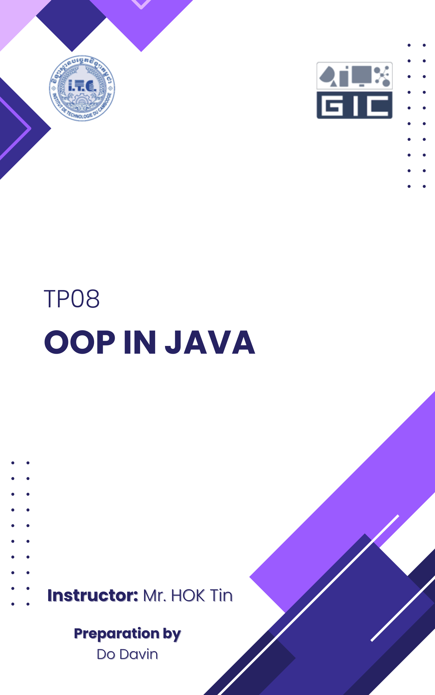

```
❖ Lab08.1. Grid Layout
Write a program to create a class “GridManagement” and implements from following “Interface GridLayout”
After all, override all functions and implement its own body statement accordingly.
    ▪ Use a 2-dimensional array to manage the (7x7) grid
    ▪ The value in each cell must be in between 0 to 9 (Set default values of each cell to zero)
    ▪ In GridManagment class, you can have more your own additional function/method if needed
```

# Source Code:

```java
package Ex1;

import java.util.Scanner;

interface GridLayout {
    void insertAtRow(int rowNumber, int[] values);
    void insertAtColumn(int columnNumber, int[] values);
    void clearAtRow(int rowNumber);
    void clearAtColumn(int columnNumber);
    void updateCell(int rowNumber, int columnNumber, int value);
    void displayGrid();
    void clear();
}

class GridManagement implements GridLayout {
    final int ROWS = 7;
    final int COLUMN = 7;
    private int[][] grid = new int[ROWS][COLUMN];

    @Override
    public void insertAtRow(int rowNumber, int[] values) {
        if (rowNumber < 0 || rowNumber >= 7 || values.length != 7) {
            System.out.println("Invalid row or values length!");
            return;
        }
        grid[rowNumber] = values.clone();
    }

    @Override
    public void insertAtColumn(int columnNumber, int[] values) {
        if (columnNumber < 0 || columnNumber >= 7 || values.length != 7) {
            System.out.println("Invalid column or values length!");
            return;
        }
        for (int i = 0; i < 7; i++) {
            grid[i][columnNumber] = values[i];
        }
    }

    @Override
    public void clearAtRow(int rowNumber) {
        if (rowNumber < 0 || rowNumber >= 7)
            return;
        for (int i = 0; i < 7; i++) {
            grid[rowNumber][i] = 0;
        }
    }

    @Override
    public void clearAtColumn(int columnNumber) {
        if (columnNumber < 0 || columnNumber >= 7)
            return;
        for (int i = 0; i < 7; i++) {
            grid[i][columnNumber] = 0;
        }
    }

    @Override
    public void updateCell(int rowNumber, int columnNumber, int value) {
        if (rowNumber < 0 || rowNumber >= 7 || columnNumber < 0 || columnNumber >= 7 || value < 0 || value > 9) {
            System.out.println("Invalid input!");
            return;
        }
        grid[rowNumber][columnNumber] = value;
    }

    @Override
    public void displayGrid() {
        System.out.println(":::: The GRID ::::\n");
        System.out.print("    ");
        for (int i = 0; i < 7; i++) {
            System.out.print(i + " ");
        }
        System.out.println();
        System.out.print("    ");
        for (int i = 0; i < 7; i++) {
            System.out.print("- ");
        }
        System.out.println();
        for (int i = 0; i < 7; i++) {
            System.out.print(i + " - ");
            for (int j = 0; j < 7; j++) {
                System.out.print(grid[i][j] + " ");
            }
            System.out.println();
        }
    }

    @Override
    public void clear() {
        for (int i = 0; i < 7; i++) {
            for (int j = 0; j < 7; j++) {
                grid[i][j] = 0;
            }
        }
    }
}

public class Main {
    public static void main(String[] args) {
        Scanner scanner = new Scanner(System.in);
        GridManagement gm = new GridManagement();
        int option;

        do {
            gm.displayGrid();
            System.out.println("\n1. Update a single cell");
            System.out.println("2. Insert at a row");
            System.out.println("3. Insert at a column");
            System.out.println("4. Clear at a row");
            System.out.println("5. Clear at a column");
            System.out.println("6. Clear all");
            System.out.println("7. Quit");
            System.out.print("Choose an option: ");
            option = scanner.nextInt();

            int row, column, value;
            int[] values;

            switch (option) {
                case 1:
                    System.out.print("Enter row (0-6): ");
                    row = scanner.nextInt();
                    System.out.print("Enter column (0-6): ");
                    column = scanner.nextInt();
                    System.out.print("Enter value (0-9): ");
                    value = scanner.nextInt();
                    gm.updateCell(row, column, value);
                    break;

                case 2:
                    System.out.print("Enter row number (0-6): ");
                    row = scanner.nextInt();
                    values = new int[7];
                    System.out.print("Enter 7 values (0-9), (Separate by space): ");
                    for (int i = 0; i < 7; i++) {
                        values[i] = scanner.nextInt();
                    }
                    gm.insertAtRow(row, values);
                    break;

                case 3:
                    System.out.print("Enter column number (0-6): ");
                    column = scanner.nextInt();
                    values = new int[7];
                    System.out.print("Enter 7 values (0-9), (Separate by space): ");
                    for (int i = 0; i < 7; i++) {
                        values[i] = scanner.nextInt();
                    }
                    gm.insertAtColumn(column, values);
                    break;

                case 4:
                    System.out.print("Enter row number (0-6): ");
                    row = scanner.nextInt();
                    gm.clearAtRow(row);
                    break;

                case 5:
                    System.out.print("Enter column number (0-6): ");
                    column = scanner.nextInt();
                    gm.clearAtColumn(column);
                    break;

                case 6:
                    gm.clear();
                    break;

                case 7:
                    System.out.println("Exiting...");
                    break;

                default:
                    System.out.println("Invalid option!");
                    break;
            }
        } while (option != 7);

        scanner.close();
    }
}
```

# Output:

```cpp
:::: The GRID ::::

    0 1 2 3 4 5 6 
    - - - - - - - 
0 - 0 0 0 0 0 0 0 
1 - 0 0 0 0 0 0 0 
2 - 0 0 0 0 0 0 0 
3 - 0 0 0 0 0 0 0 
4 - 0 0 0 0 0 0 0 
5 - 0 0 0 0 0 0 0 
6 - 0 0 0 0 0 0 0 

1. Update a single cell
2. Insert at a row
3. Insert at a column
4. Clear at a row
5. Clear at a column
6. Clear all
7. Quit
Choose an option: 2
Enter row number (0-6): 0
Enter 7 values (0-9), (Separate by space): 1 2 3 4 5 6 7     
:::: The GRID ::::

    0 1 2 3 4 5 6 
    - - - - - - - 
0 - 1 2 3 4 5 6 7 
1 - 0 0 0 0 0 0 0 
2 - 0 0 0 0 0 0 0 
3 - 0 0 0 0 0 0 0 
4 - 0 0 0 0 0 0 0 
5 - 0 0 0 0 0 0 0 
6 - 0 0 0 0 0 0 0 

1. Update a single cell
2. Insert at a row
3. Insert at a column
4. Clear at a row
5. Clear at a column
6. Clear all
7. Quit
Choose an option: 3
Enter column number (0-6): 6
Enter 7 values (0-9), (Separate by space): 7 6 5 4 3 2 1
:::: The GRID ::::

    0 1 2 3 4 5 6 
    - - - - - - -
0 - 1 2 3 4 5 6 7
1 - 0 0 0 0 0 0 6
2 - 0 0 0 0 0 0 5
3 - 0 0 0 0 0 0 4
4 - 0 0 0 0 0 0 3
5 - 0 0 0 0 0 0 2
6 - 0 0 0 0 0 0 1

1. Update a single cell
2. Insert at a row
3. Insert at a column
4. Clear at a row
5. Clear at a column
6. Clear all
7. Quit
Choose an option: 7
Exiting...
```

```
❖ Lab08.2. The Bank
Write a program to create a bank management system and manage accounts, and
transaction. You must have two needed classes “Account” and “BankManagment”
▪ Withdraw/Deposit (Use Exceptions to prevent wrong input ):
    ▪ Minimum and maximum balance limits (ensure that the account balance
    does not fall below or exceed a certain)
    ▪ The input field for the account balance should accept only numeric values
    Allow only two decimal points and prevent users from inputting values
    such as $100.1234
    ▪ Deposit range ( 0 < amount <= 1000$ )
▪ Transferring money must be through ACCOUNT_ID

*** All attributes of class Account must be in private access
*** Implement Setter and Getter concepts
```

# Source Code:

```java
// Account
package Ex2;

public class Account {
    private int acc_id;
    private String acc_holder;
    private double balance;

    Account(int acc_id, String acc_holder, double balance){
        this.acc_id = acc_id;
        this.acc_holder = acc_holder;
        this.balance = balance;
    }

    public int getId(){
        return acc_id;
    }

    public String getAccHolder(){
        return acc_holder;
    }

    public double getAccBalance(){
        return balance;
    }

    public void setId(int acc_id){
        this.acc_id = acc_id;
    }

    public void setAccHolder(String acc_holder){
        this.acc_holder = acc_holder;
    }

    public void setAccBalance(double balance){
        this.balance = balance;
    }

    public void deposit(double amount){
        balance += amount;
    }

    public boolean withdraw(double amount, double minBalance){
        if(balance - amount >= minBalance) {
            balance -= amount;
            return true;
        } else {
            return false;
        }
    }
}
```

```java
// BankManagement
package Ex2;

import java.util.ArrayList;

public class BankManagement {
    private ArrayList<Account> accounts = new ArrayList<>();

    public void createAccount(int id, String name, double balance){
        for(Account account : accounts){
            if(account.getId() == id){
                System.out.println(Color.RED + "\nID can't be duplicate!" + Color.RESET);
                return;
            }
        }
        accounts.add(new Account(id, name, balance));
        System.out.println(Color.GREEN + "\nAccount created successfully!\n" + Color.RESET);
    }

    public void showAccounts(){
        int no = 1;
        boolean hasAccount = false;
        for(Account account : accounts){
            if(account != null){
                hasAccount = true;
                System.out.println(Color.ORANGE + "\nNo #" + (no++));
                System.out.println("ACC_ID: " + account.getId());
                System.out.println("ACC_HOLDER: " + account.getAccHolder());
                System.out.printf("ACC_BALANCE: %.2f$\n\n" + Color.RESET, account.getAccBalance());
            }
        }

        if(!hasAccount){
            System.out.println(Color.RED + "\nNo accounts have been created!\n" + Color.RESET);
        }
    }

    public Account findAccount(int id){
        for(Account account : accounts){
            if(account.getId() == id){
                return account;
            }
        }
        return null;
    }

    public void deposit(int id, double amount) {
        Account account = findAccount(id);
        if(account != null){
            account.deposit(amount);
            System.out.println(Color.GREEN + "\nDeposited successfully!\n" + Color.RESET);
        } else {
            System.out.println(Color.RED + "\nAccount not found.\n" + Color.RESET);
        }
    }

    public void withdraw(int id, double amount){
        Account account = findAccount(id);
        if(account != null){
            if(account.withdraw(amount, 0)) {
                System.out.println(Color.GREEN + "\nWithdrawal successfully!\n" + Color.RESET);
            } else {
                System.out.println(Color.RED + "\nNot enough balance!\n" + Color.RESET);
            } 
        } else {
            System.out.println(Color.RED + "\nAccount not found.\n" + Color.RESET);
        }
    }

    public void transfer(int fromId, int toId, double amount){
        Account from = findAccount(fromId);
        Account to = findAccount(toId);
        if(from == null || to == null){
            System.out.println(Color.RED + "\nOne of the accounts not found!\n" + Color.RESET);
            return;
        }
        if(from.withdraw(amount, 0)) {
            to.deposit(amount);
            System.out.println(Color.GREEN + "\nTransfer successfully!\n" + Color.RESET);
        } else {
            System.out.println(Color.RED + "\nTransfer failed: not enough balance.\n" + Color.RESET);
        }
    }

    public boolean isValidDecimal(double value){
        return Math.round(value * 100.0) == value * 100.0;
    }
}
```

```java
// Color
package Ex2;

public class Color {
    public static final String RESET = "\u001B[0m";
    public static final String RED = "\u001B[31m";
    public static final String GREEN = "\u001B[32m";
    public static final String ORANGE = "\u001B[38;5;208m";
    public static final String YELLOW  = "\u001B[33m";
    public static final String BLUE    = "\u001B[34m";
    public static final String LIGHT_BLUE = "\u001B[94m";
}
```

```java
// Main
package Ex2;

import java.util.Scanner;

public class Main {
    private final static double MIN_BALANCE = 0.0;
    private final static double MAX_BALANCE = 1000000.0;
    public static void main(String[] args) {
        BankManagement bank = new BankManagement();
        Scanner scanner = new Scanner(System.in);

        int choice;
        do {

            System.out.printf(Color.YELLOW + "\n\t+----------------------------------+\n");
            System.out.printf("\t|         ::: The Bank :::         |\n");
            System.out.printf("\t+----------------------------------+\n");
            System.out.printf("\t| %-2d. %-28s |\n", 1, "Account List");
            System.out.printf("\t| %-2d. %-28s |\n", 2, "Create an account");
            System.out.printf("\t| %-2d. %-28s |\n", 3, "Deposit to an account");
            System.out.printf("\t| %-2d. %-28s |\n", 4, "Withdraw from an account");
            System.out.printf("\t| %-2d. %-28s |\n", 5, "Transfer to another account");
            System.out.printf("\t| %-2d. %-28s |\n", 6, "Quit");
            System.out.printf("\t+----------------------------------+\n\n" + Color.RESET);
            
            while(true){
                try {
                    System.out.print(Color.YELLOW + "Choose an option: " + Color.RESET);
                    choice = scanner.nextInt();
                    break;
                } catch (Exception e) {
                    System.out.println(Color.RED + "\nChoice can't be character or any special character!\n" + Color.RESET);
                    scanner.nextLine();
                }
            }
          
            double amount;
            int fromId;
            int toId;

            switch(choice){
                case 1:
                    bank.showAccounts();
                    break;
                case 2:
                    int id;
                    String name;
                    double balance;

                    while(true){
                        try {  
                            System.out.print(Color.YELLOW + "Enter ID: " + Color.RESET);
                            id = scanner.nextInt();
                            scanner.nextLine();
                            break;
                        } catch (Exception e) {
                            System.out.println(Color.RED + "\nInvalid ID. Please enter a numeric value instead of text!\n" + Color.RESET);
                            scanner.nextLine();
                        }
                    }

                    while(true){
                        System.out.print(Color.YELLOW + "Enter Name: " + Color.RESET);
                        name = scanner.nextLine();
                        if(name.matches("[a-zA-z ]+")) {
                            break;
                        } else {
                            System.out.println(Color.RED + "\nInvalid name. Please use letters only!\n" + Color.RESET);
                        }
                    }

                    while(true){
                        try {
                            System.out.print(Color.YELLOW + "Enter Balance: " + Color.RESET);
                            balance = scanner.nextDouble();
                            scanner.nextLine();
                            if(balance < MIN_BALANCE || balance > MAX_BALANCE || !bank.isValidDecimal(balance)) {
                                   System.out.println(Color.RED + 
                                    "Please enter a valid balance:\n" +
                                    "- It must be a positive number.\n" +
                                    "- It can have at most **two decimal places**.\n" +
                                    "- The maximum allowed balance is **1,000,000**." + 
                                    Color.RESET);
                            } else {
                                break;
                            }
                        } catch (Exception e) {
                            System.out.println(Color.RED + "\nInvalid balance. Please enter a numeric value.\n" + Color.RESET);
                            scanner.nextLine();
                        }
                    }

                    bank.createAccount(id, name, balance);
                    break;
                case 3:
                    while(true){
                        try {
                            System.out.print(Color.YELLOW + "Enter Account ID: " + Color.RESET);
                            id = scanner.nextInt();
                            scanner.nextLine();
                            break;
                        } catch (Exception e) {
                            System.out.println(Color.RED + "\nInvalid ID. Please enter a numeric value instead of text!\n" + Color.RESET);
                            scanner.nextLine();
                        }
                    }

                    while(true){
                        try { 
                            System.out.print(Color.YELLOW + "Enter Amount: " + Color.RESET);
                            amount = scanner.nextDouble();
                            if(amount <= MIN_BALANCE || amount > MAX_BALANCE || !bank.isValidDecimal(amount)) {
                                  System.out.println(Color.RED + 
                                    "Please enter a valid amount:\n" +
                                    "- It must be a positive number.\n" +
                                    "- It can have at most **two decimal places**.\n" +
                                    "- The maximum allowed balance is **1,000,000**." + 
                                    Color.RESET);
                            } else {
                                break;
                            }
                        } catch (Exception e) {
                            System.out.println(Color.RED + "\nInvalid amount. Please enter a numeric value instead of text!\n" + Color.RESET);
                            scanner.nextLine();
                        }
                    }

                    bank.deposit(id, amount);
                    break;
                case 4:
                    while (true) {
                        try {
                            System.out.print(Color.YELLOW + "Enter Account ID: " + Color.RESET);
                            id = scanner.nextInt();
                            scanner.nextLine();
                            break;
                        } catch (Exception e) {
                            System.out.println(Color.RED + "\nInvalid ID. Please enter a numeric value instead of text!\n" + Color.RESET);
                            scanner.nextLine();
                        }   
                    }

                    while(true){
                        try { 
                            System.out.print(Color.YELLOW + "Enter Amount: " + Color.RESET);
                            amount = scanner.nextDouble();
                            if(amount <= MIN_BALANCE || amount > MAX_BALANCE || !bank.isValidDecimal(amount)) {
                                System.out.println(Color.RED + 
                                    "Please enter a valid amount:\n" +
                                    "- It must be a positive number.\n" +
                                    "- It can have at most **two decimal places**.\n" +
                                    "- The maximum allowed balance is **1,000,000**." + 
                                    Color.RESET);
                            } else {
                                break;
                            }
                        } catch (Exception e) {
                            System.out.println(Color.RED + "\nInvalid amount. Please enter a numeric value instead of text!\n" + Color.RESET);
                            scanner.nextLine();
                        }
                    }

                    bank.withdraw(id, amount);
                    break;
                case 5:
                    while (true) {
                        try {     
                            System.out.print(Color.YELLOW + "From Account ID: " + Color.RESET);
                            fromId = scanner.nextInt();
                            break;
                        } catch (Exception e) {
                            System.out.println(Color.RED + "\nInvalid ID. Please enter a numeric value instead of text!\n" + Color.RESET);
                            scanner.nextLine();
                        }
                    }

                    while (true) {
                        try {         
                            System.out.print(Color.YELLOW + "To Account ID: " + Color.RESET);
                            toId = scanner.nextInt();
                            break;
                        } catch (Exception e) {
                            System.out.println(Color.RED + "\nInvalid ID. Please enter a numeric value instead of text!\n" + Color.RESET);
                            scanner.nextLine();
                        }
                    }

                    while(true){
                        try { 
                            System.out.print(Color.YELLOW + "Enter Amount: " + Color.RESET);
                            amount = scanner.nextDouble();
                            if(amount <= MIN_BALANCE || amount > MAX_BALANCE || !bank.isValidDecimal(amount)) {
                                    System.out.println(Color.RED + 
                                    "Please enter a valid amount:\n" +
                                    "- It must be a positive number.\n" +
                                    "- It can have at most **two decimal places**.\n" +
                                    "- The maximum allowed balance is **1,000,000**." + 
                                    Color.RESET);
                            } else {
                                break;
                            }
                        } catch (Exception e) {
                            System.out.println(Color.RED + "\nInvalid amount. Please enter a numeric value instead of text!\n" + Color.RESET);
                            scanner.nextLine();
                        }
                    }

                    bank.transfer(fromId, toId, amount);
                    break;
                case 6:
                    System.out.println("\nExiting program...\n");
                    break;
                default:
                    System.out.println(Color.RED + "\nInvalid option, please try again...\n" + Color.RESET);
                    break;
            }

        } while(choice != 6);
        scanner.close();
    }
}
```

# Output:

```cpp
        +----------------------------------+
        |         ::: The Bank :::         |
        +----------------------------------+
        | 1 . Account List                 |
        | 2 . Create an account            |
        | 3 . Deposit to an account        |
        | 4 . Withdraw from an account     |
        | 5 . Transfer to another account  |
        | 6 . Quit                         |
        +----------------------------------+

Choose an option: 2
Enter ID: 1010
Enter Name: Do Davin
Enter Balance: 1000

Account created successfully!


        +----------------------------------+
        |         ::: The Bank :::         |
        +----------------------------------+
        | 1 . Account List                 |
        | 2 . Create an account            |
        | 3 . Deposit to an account        |
        | 4 . Withdraw from an account     |
        | 5 . Transfer to another account  |
        | 6 . Quit                         |
        +----------------------------------+

Choose an option: 2
Enter ID: 2020
Enter Name: Kol Thyda
Enter Balance: 2000

Account created successfully!


        +----------------------------------+
        |         ::: The Bank :::         |
        +----------------------------------+
        | 1 . Account List                 |
        | 2 . Create an account            |
        | 3 . Deposit to an account        |
        | 4 . Withdraw from an account     |
        | 5 . Transfer to another account  |
        | 6 . Quit                         |
        +----------------------------------+

Choose an option: 1

No #1
ACC_ID: 1010
ACC_HOLDER: Do Davin
ACC_BALANCE: 1000.00$


No #2
ACC_ID: 2020
ACC_HOLDER: Kol Thyda
ACC_BALANCE: 2000.00$


        +----------------------------------+
        |         ::: The Bank :::         |
        +----------------------------------+
        | 1 . Account List                 |
        | 2 . Create an account            |
        | 3 . Deposit to an account        |
        | 4 . Withdraw from an account     |
        | 5 . Transfer to another account  |
        | 6 . Quit                         |
        +----------------------------------+

Choose an option: 5
From Account ID: 1010
To Account ID: 2020 
Enter Amount: 1000

Transfer successfully!


        +----------------------------------+
        |         ::: The Bank :::         |
        +----------------------------------+
        | 1 . Account List                 |
        | 2 . Create an account            |
        | 3 . Deposit to an account        |
        | 4 . Withdraw from an account     |
        | 5 . Transfer to another account  |
        | 6 . Quit                         |
        +----------------------------------+

Choose an option: 1

No #1
ACC_ID: 1010
ACC_HOLDER: Do Davin
ACC_BALANCE: 0.00$


No #2
ACC_ID: 2020
ACC_HOLDER: Kol Thyda
ACC_BALANCE: 3000.00$


        +----------------------------------+
        |         ::: The Bank :::         |
        +----------------------------------+
        | 1 . Account List                 |
        | 2 . Create an account            |
        | 3 . Deposit to an account        |
        | 4 . Withdraw from an account     |
        | 5 . Transfer to another account  |
        | 6 . Quit                         |
        +----------------------------------+

Choose an option: 6

Exiting program...
```

<center>

# END

</center>